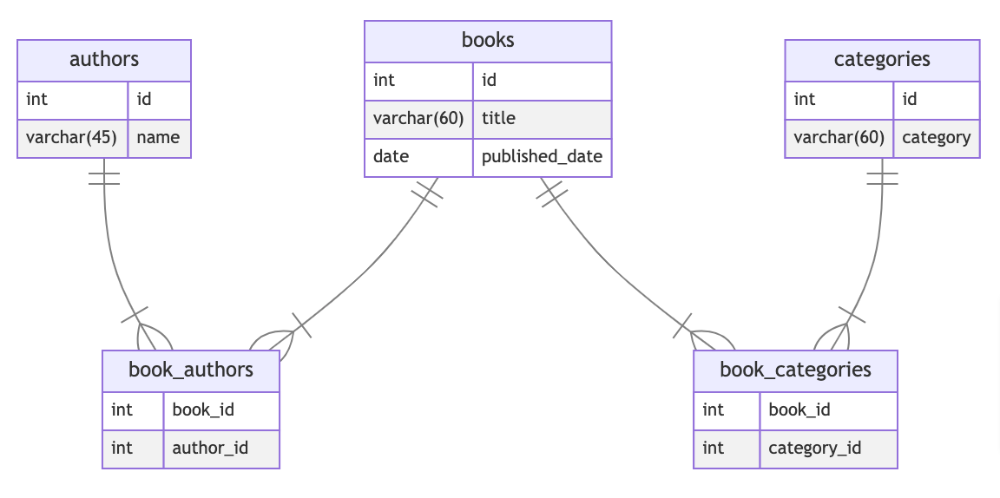

# gerd

## install
```shell
$ git clone https://github.com/ritarock/gerd.git
$ cd gerd
$ make install
```

## Usage
```shell
$ gerd -h
make entity relationship diagram

Usage:
  gerd [flags]
  gerd [command]

Available Commands:
  help        Help about any command
  server      show created mermaid file

Flags:
  -a, --address string    connection address (required)
  -d, --db string         connection db name (required)
  -h, --help              help for gerd
  -p, --password string   database password (required)
  -u, --user string       database user name (required)

$ gerd server -h
show mermaid file.
access to http://localhost:8080

Usage:
  gerd server [flags]

Flags:
  -h, --help   help for server
```

## Sample
```shell
$ docker-compose up -d

$ gerd -a localhost:3306 -d app -u user -p pass

$ gerd server
server started
http://localhost:8080
```


